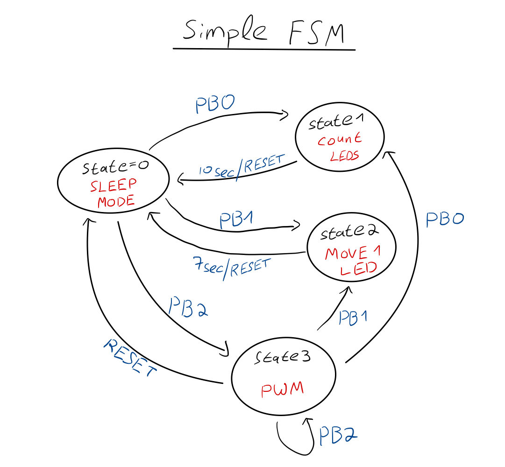

# Assembly-Interrupts-LPM

This repository contains our implementation of Interrupts and Low Power Mode (LPM) for the MSP430 microcontroller, developed for Lab 4 of the "Introduction to Computers" course.

## Repository Contents

### Code Files
- [API Module (api.s43)](./code/api.s43) - Implements high-level tasks and functionality
- [BSP Header (bsp.h)](./code/bsp.h) - Board Support Package definitions and configurations
- [BSP Module (bsp.s43)](./code/bsp.s43) - Hardware configuration and GPIO setup
- [HAL Module (hal.s43)](./code/hal.s43) - Hardware Abstraction Layer implementing core functionality
- [Main Program (main.s43)](./code/main.s43) - Main application logic and finite state machine

### Documentation
- [Pre-lab Assignment](./docs/lab4_pre_assignment.pdf) - Initial preparation for interrupt handling and low power modes
- [Preparation Report](./docs/lab4_preparation_report.pdf) - Detailed documentation of lab preparation
- [Final Lab Report](./docs/lab4_final_report.pdf) - Complete analysis and results of the implementation

### System Design


## System Architecture

The code is organized in a layered architecture following embedded systems best practices:

1. **BSP (Board Support Package)**: Hardware-specific definitions and GPIO configuration
2. **HAL (Hardware Abstraction Layer)**: Low-level hardware control and common utilities 
3. **API (Application Programming Interface)**: High-level functions that implement specific tasks
4. **Main Application**: Implements the finite state machine and orchestrates the system

## Key Features

### 1. Interrupt-Driven Design
The system is primarily controlled through push-button interrupts (P2 port):
```assembly
PORT2_ISR    push   #DebounceVal
             call   #Delay
             bit.b  #0x01,PBIntFlag   ; Check if PB0 is pushed
             jnz    P2_0
             bit.b  #0x02,PBIntFlag   ; Check if PB1 is pushed
             jnz    P2_1
             ...
```

### 2. Low Power Mode Implementation
The system enters LPM0 (Low Power Mode 0) when in the idle state and wakes up via interrupts:
```assembly
state0   cmp    #0,state
         jnz    state1
         bis.w  #CPUOFF+GIE,SR    ; Enter LPM0 with interrupts enabled
```

### 3. Finite State Machine
The system implements a 5-state FSM:
- **State 0**: Idle state (LPM0)
- **State 1**: Incrementing LEDs pattern
- **State 2**: Shifting LED pattern
- **State 3**: PWM (Pulse Width Modulation) generation
- **State 4**: Display ID pattern on LEDs

### 4. PWM Generation
Software-based PWM is implemented using precise timing:
```assembly
PWM        cmp      #3,state         
           jnz      FINISH           
           bis.b    #0x80,PWMPort    ; PWM ~ 1 (high)
           mov.b    #64,R12          ; Duration for high state            
loop_one   dec      R12              
           jnz      loop_one         
           
           bic.b    #0x80,PWMPort    ; PWM ~ 0 (low)
           mov.b    #17,R12          ; Duration for low state
loop_zero  dec      R12              
           jnz      loop_zero        
           jmp      PWM              
```

### 5. Timing Control
Various delay functions provide precise timing control:
- `Delay`: General-purpose delay loop
- `Delay1ms`: 1ms precision delay
- `delay_ms`: Variable millisecond delay
- `Delay_halfsec`: 0.5 second delay

## Usage

1. Connect the MSP430 development board to your computer
2. Configure LEDs on P1 and push buttons on P2 as specified in bsp.h
3. Build and flash the code using IAR Embedded Workbench or Code Composer Studio
4. The system begins in the idle state (State 0) in low power mode
5. Press the push buttons to activate different functions:
   - PB0 (P2.0): Activate State 1 - Incrementing LEDs pattern
   - PB1 (P2.1): Activate State 2 - Shifting LED pattern
   - PB2 (P2.2): Activate State 3 - PWM generation
   - PB3 (P2.3): Activate State 4 - Display ID pattern on LEDs

## Hardware Requirements

- MSP430G2553 microcontroller
- LEDs connected to P1 port
- Push buttons connected to P2 port (P2.0-P2.3)
- Optional: Oscilloscope to visualize PWM output on P2.7

## Authors

Created by Asaf Kamber and Aviv Primor

## Course Information

- Course: Introduction to Computers
- Lab: Interrupts and Low Power Mode (Lab 4)
